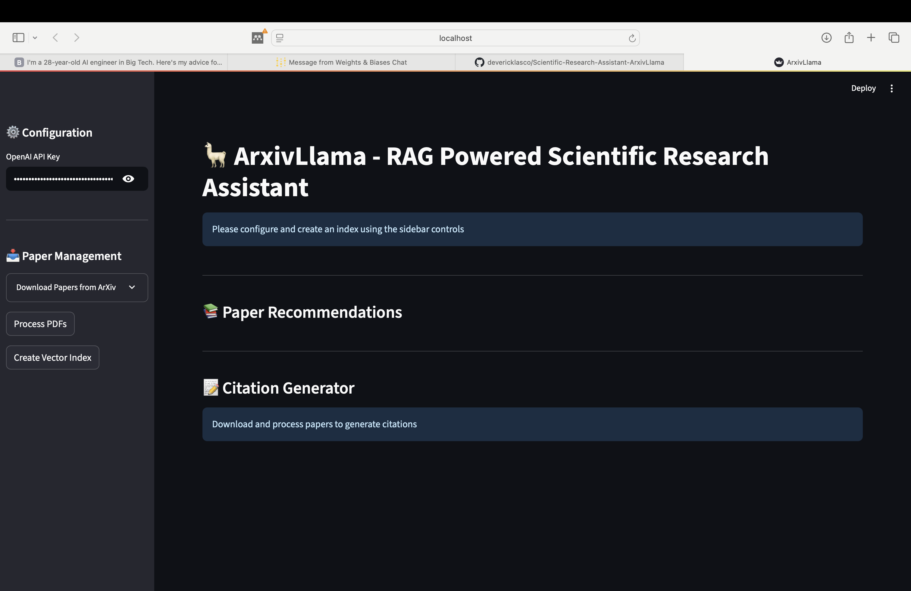
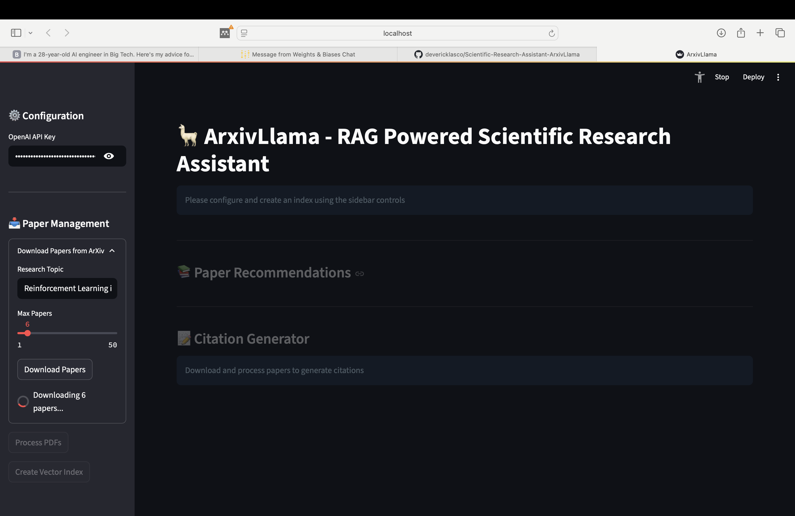
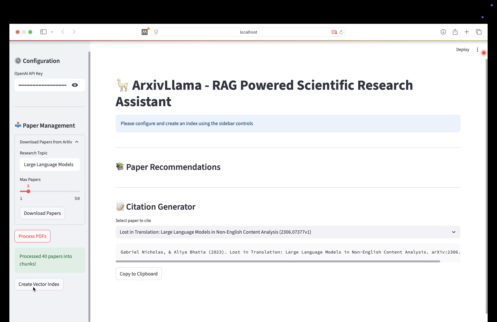
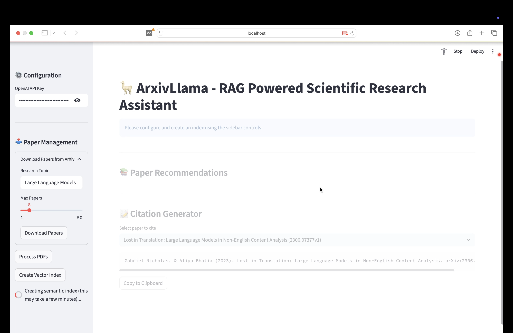
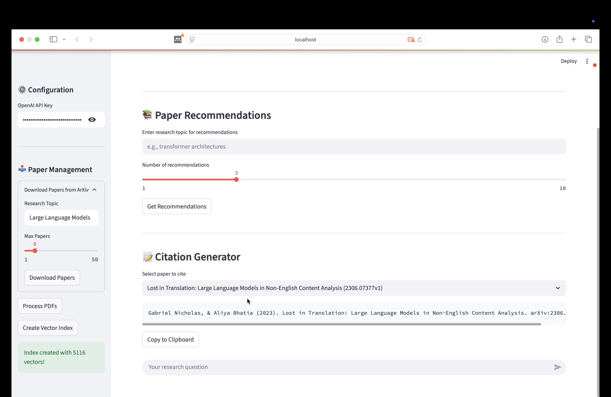
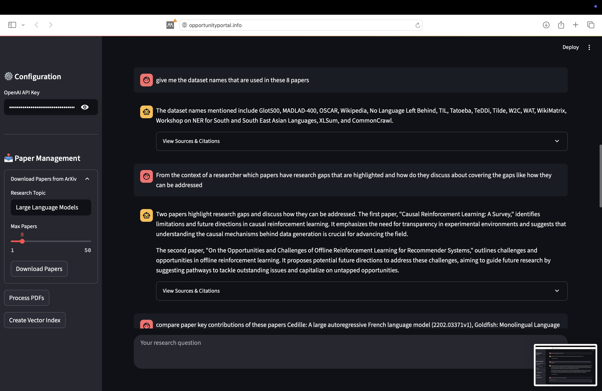
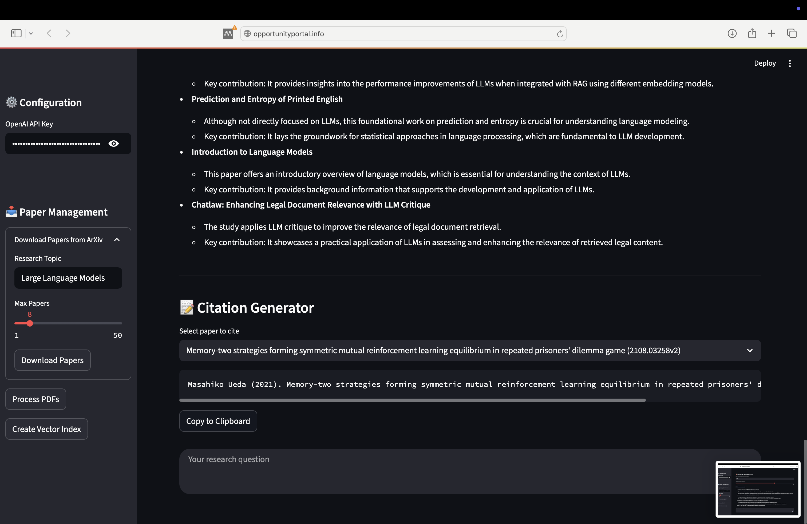
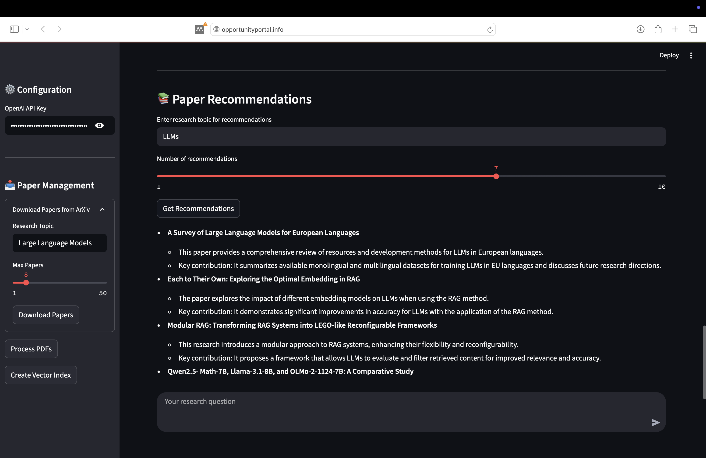

# ArxivLlama 🦙📚  
*A RAG-powered Scientific Research Assistant for ArXiv Papers*

[]()  
[]()  
[]()

**ArxivLlama** transforms the way you explore and understand scientific literature by integrating Retrieval-Augmented Generation (RAG), natural language interfaces, and semantic search. This tool enables researchers to **search, analyze, summarize, and cite ArXiv papers with ease**.



---

## ✨ Features

### 📄 Paper Discovery
- 🔍 Search and download papers from ArXiv by topic  
- 📥 Automatically extract metadata (title, authors, abstract)  
- ⚡ Supports batch downloads (up to 50 papers at a time)  

### 🧠 Intelligent Analysis
- 🦙 RAG-powered semantic understanding using **LlamaIndex**  
- 💬 Query paper content in natural language  
- 📊 Retrieve responses with relevance-based citations  
- 📖 Get contextual excerpts from the source documents  


### 🛠️ Research Tools
- 📑 APA-style citation generator  
- 📚 AI-driven paper recommendations  
- 💰 Cost tracking for OpenAI API calls  
- 🗂️ Persistent vector storage via **ChromaDB**  

## Installation & Setup
# Clone the repository
git clone https://github.com/devericklasco/Scientific-Research-Assistant-ArxivLlama.git
cd Scientific-Research-Assistant-ArxivLlama

# Create and activate a virtual environment
python -m venv .venv
source .venv/bin/activate       # Linux/MacOS
.\.venv\Scripts\activate        # Windows

# Install dependencies
pip install -r requirements.txt

# Set up environment variables
cp .env.example .env

# Run the Streamlit app
streamlit run app.py

### Usage Guide
## Step 1: Download Papers
Input your research topic (e.g., "reinforcement learning in robotics")

Choose the number of papers to download (1–50)

Downloads saved to: data/papers/

  


## Step 2: Process PDFs
Automatically extract and chunk text semantically

Outputs stored in: data/chunks/ as .json
 

## Step 3: Create Vector Index
Builds a semantic index from paper chunks

Uses OpenAI embeddings with optional cost tracking

Output: searchable knowledge base



## Step 4: Query Research Papers
Ask questions like:
Get responses with source citations and context

APA citations are included


## Step 5: Get Paper Recommendations
Based on semantic similarity to your questions or uploaded content

Helps discover relevant papers within your indexed library




## Contact  
Built with ❤️ by [Erick Busuulwa](https://github.com/devericklasco)  
Follow me on [Twitter](https://x.com/ericklasco)  


---

## 🧱 Tech Stack

```mermaid
graph LR
A[ArXiv API] --> B[PDF Processing]
B --> C[Text Chunking]
C --> D[Embedding Generation]
D --> E[Vector DB: ChromaDB]
E --> F[Query Engine: LlamaIndex]
F --> G[LLM Interface: OpenAI]
G --> H[Streamlit UI]

